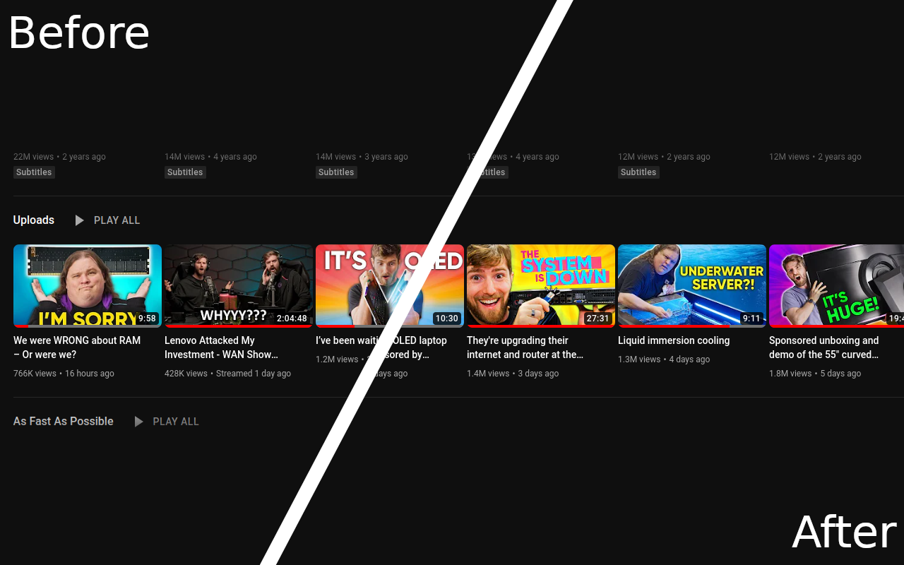

# Switch the Bait Webextension

A webextension for Chromium and Firefox browsers that helps you switch out click bait titles for something a little more suitable.

This is a very early version of the extension that only works with https://youtube.com/c/LinusTechTips. There will be more places that the titles are replaced soon!

Supported browsers:

Brave ✅
Chrome ✅
Firefox ✅

## Installation instructions

Download the appropriate release package for your browser. Unzip the file to a folder and then follow the approriate instructions for your browser.

**Note that these are not a permanent install and will be cleared after your browser is restarted. You will need to follow these instructions again.** - Once Google and Mozilla approve this addon this will not be a problem.

### Chrome (and other Chromium friends)

Navigate to [chrome://extensions](chrome://extensions) and activate "Developer mode".

Click the "Load unpacked" button and choose the folder where you unzipped the extension to.

You should now see the Switch the Bait extension loaded. Go to https://youtube.com/c/LinusTechTips for some less click baity titles (see the Uploads group).

### Firefox

Navigate to [about:debugging](about:debugging) and choose "This Firefox".

Click the "Load Temporary Add-on..." button and choose the folder where you unzipped the extension to.

You should now see the Switch the Bait extension loaded. Go to https://youtube.com/c/LinusTechTips for some less click baity titles (see the Uploads group).
